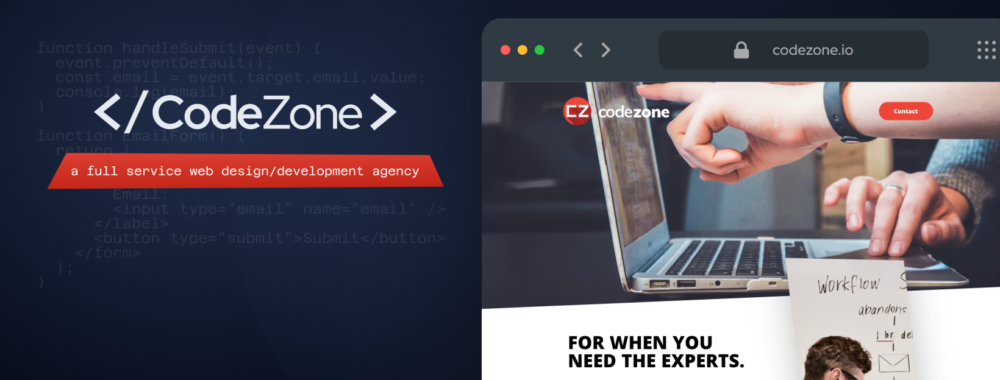
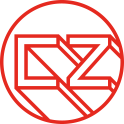
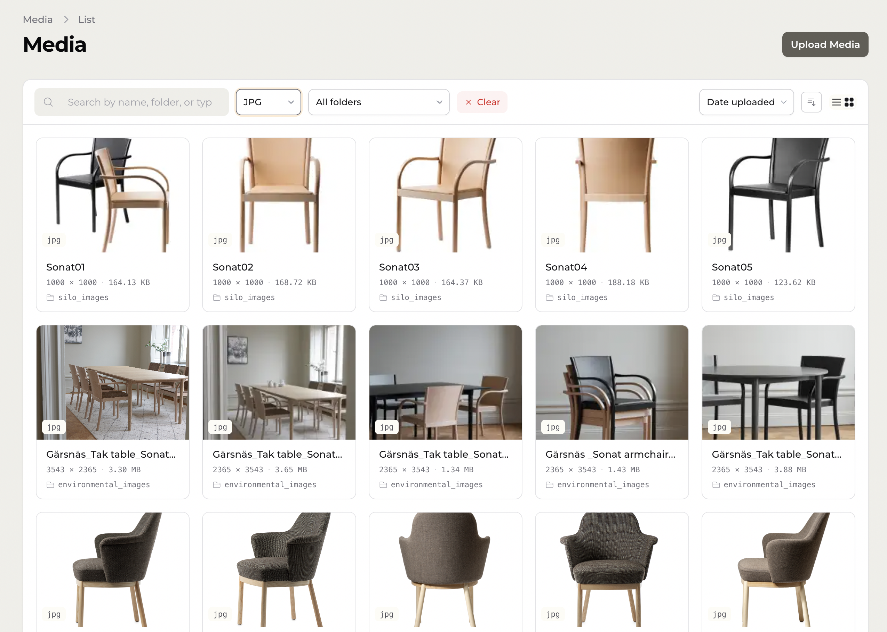
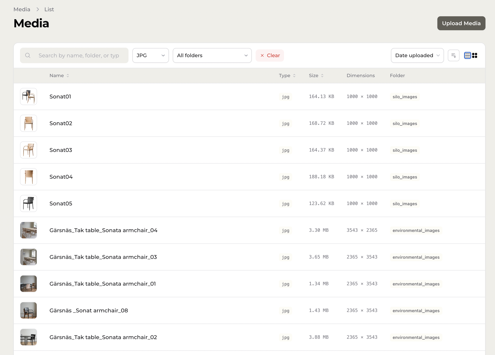
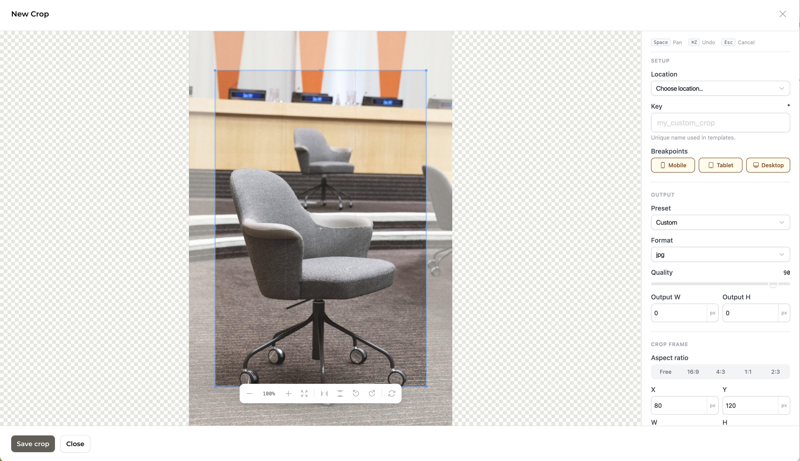
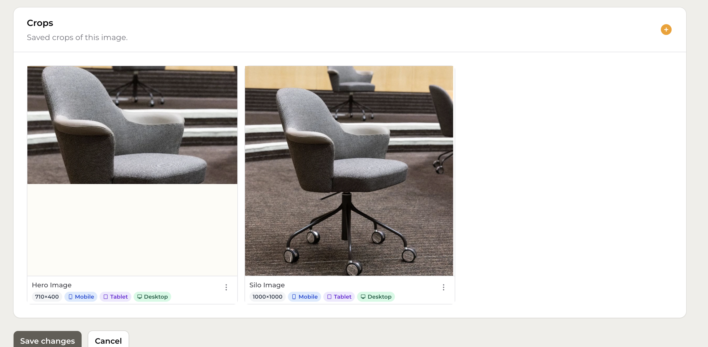
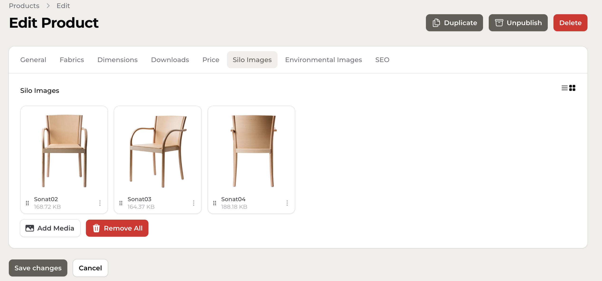

<p align="center">
  <a href="https://codezone.io/">
    
  </a>
</p>

# Filament MediaZone

A full-featured media manager for [Laravel Filament](https://filamentphp.com/). Upload, browse, crop, and serve images and files from any Laravel filesystem disk — all within your Filament admin panel. Made with care by [CodeZone](https://codezone.io).

**[Full documentation →](https://thecodezone.github.io/filament-mediazone/)**



---

## Features

- **Media library** — Grid and list browsing with search, folder, and type filters
- **File uploads** — Drag-and-drop or click-to-upload with configurable accepted types and size limits
- **Image cropping** — Interactive cropper with presets, locations, aspect ratio, format, and quality controls
- **Glide integration** — On-the-fly image transformations served via [League Glide](https://glide.thephpleague.com/) with signed URLs
- **MediaPicker field** — Drop-in Filament form field for single or multi-select media on any form
- **Configurable model** — Bring your own `Media` model; the package derives the table name automatically
- **Tenant-aware** — Works with Filament's multi-tenancy; edit URLs resolve with the correct tenant context
- **Rename files** — Rename media directly from the edit form; the physical file on disk is moved automatically

---

## Requirements

- PHP 8.2+
- Laravel 11 or 12
- Filament 3.2+
- Livewire 3.0+
- Imagick or GD extension

---

## Installation

### 1. Require the package

```bash
composer require codezone/filament-mediazone
```

### 2. Publish and run the migration

```bash
php artisan vendor:publish --tag=mediazone-migrations
php artisan migrate
```

### 3. Publish the config

```bash
php artisan vendor:publish --tag=mediazone-config
```

This creates `config/media.php`. See the [Configuration docs](https://thecodezone.github.io/filament-mediazone/configuration.html) for all available options.

### 4. Publish assets

```bash
php artisan filament:assets
```

Run this once after install and again after each upgrade.

### 5. Register the plugin

Add `MediaZonePlugin` to your Filament panel provider:

```php
use Codezone\MediaZone\MediaZonePlugin;

public function panel(Panel $panel): Panel
{
    return $panel
        ->plugins([
            MediaZonePlugin::make(),
        ]);
}
```

### 6. Configure a filesystem disk

Add a `media` disk to `config/filesystems.php` (or point `MEDIA_FILESYSTEM_DISK` to an existing disk):

```php
'media' => [
    'driver' => 'local',
    'root'   => storage_path('app/public/media'),
    'url'    => env('APP_URL').'/storage/media',
    'visibility' => 'public',
],
```

---

## Quick start

After installation, navigate to **Content → Media** in your Filament panel. Upload files via the **Create** button or drag-and-drop.

To add a media picker to any Filament form:

```php
use Codezone\MediaZone\Forms\Components\MediaPicker;

MediaPicker::make('image_id')
    ->label('Featured Image'),
```

For full usage — including crop presets, locations, multi-select, and custom models — see the **[documentation](https://thecodezone.github.io/filament-mediazone/)**.

| | |
|---|---|
|  |  |
|  |  |

---

## Contributing

### Prerequisites

- [PHP 8.2+](https://www.php.net/)
- [Composer](https://getcomposer.org/)
- [Node.js 20+](https://nodejs.org/) and npm
- [Imagick](https://www.php.net/manual/en/book.imagick.php) PHP extension

### Setting up the development environment

The package is developed as part of a Laravel application using [ddev](https://ddev.com/). If you are working within that monorepo, the environment is already running. For standalone development, install dependencies directly:

```bash
# PHP dependencies
composer install

# Node dependencies
npm install
```

### Running the test suite

```bash
vendor/bin/phpunit
```

Tests use [Orchestra Testbench](https://github.com/orchestral/testbench) and run against both Laravel 11 and 12. The CI matrix covers PHP 8.2 and 8.3.

### Linting

All three linters must pass before a PR can merge.

```bash
# Check only (what CI runs)
vendor/bin/pint --test
npm run eslint
npm run stylelint

# Auto-fix
vendor/bin/pint
npm run eslint:fix
npm run stylelint:fix

# Fix everything at once
npm run fix
```

Code style follows the [Laravel Pint](https://laravel.com/docs/pint) preset with `declare_strict_types` enforced. JavaScript follows the ESLint config in `eslint.config.js`. CSS follows the Stylelint BEM pattern config.

### Pull requests

1. Fork the repository and create a branch from `main`
2. Make your changes with tests where applicable
3. Ensure `vendor/bin/phpunit`, `vendor/bin/pint --test`, `npm run eslint`, and `npm run stylelint` all pass
4. Open a pull request against `main` — CI will run automatically

### Documentation

Documentation lives in `Writerside/topics/` as Markdown files and is built with [JetBrains Writerside](https://www.jetbrains.com/writerside/). It is automatically deployed to [GitHub Pages](https://thecodezone.github.io/filament-mediazone/) on every push to `main`. Edit the topic files and the build will update on merge.

---

## About CodeZone

[CodeZone](https://codezone.io) is a web development studio specializing in Laravel, Filament, and modern PHP applications. We build tools and packages that help developers ship great products faster.

## Support CodeZone

Filament MediaZone is free and open source. If it saves you time, consider [supporting ongoing development via PayPal](https://www.paypal.com/donate/?hosted_button_id=T2TCWZXD7J97E).

---

## License

MIT — see [LICENSE](LICENSE) for details.
